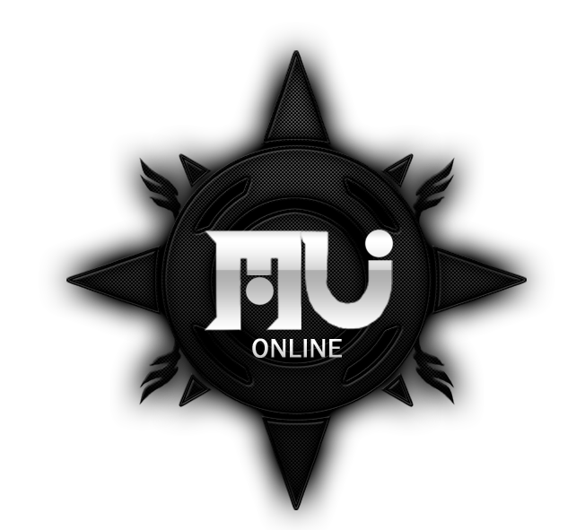
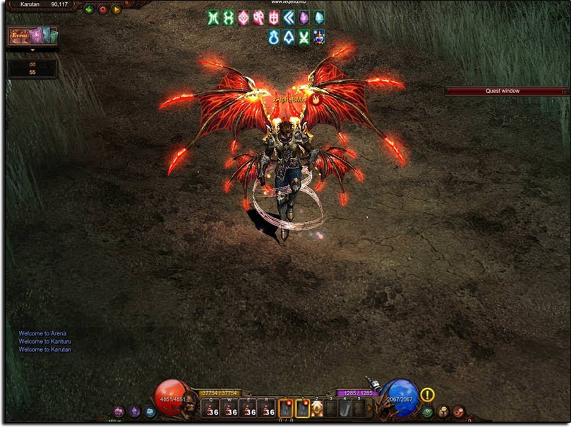

# MU Online Season 8 Episode 2

Repack of zTeam's MuOnline Season 8 Episode 2  
Project includes Gameserver, Multiserver, Client and Database developments

### Requirements
- Visual Studio 2010/2013
- SQL Server 2008 R2
- MU Online S8EP2 (1.04c)

### Contributors
- [zTeam](https://forum.ragezone.com/f197/zteam-season-8-episode-2-a-1068058/) Original MU Season 8 Episode 2  
- [kyleruss](https://github.com/kyleruss) Repack developer

### Lisence
This project is available under the MIT License  
See [LICENSE](LICENSE) for more details
